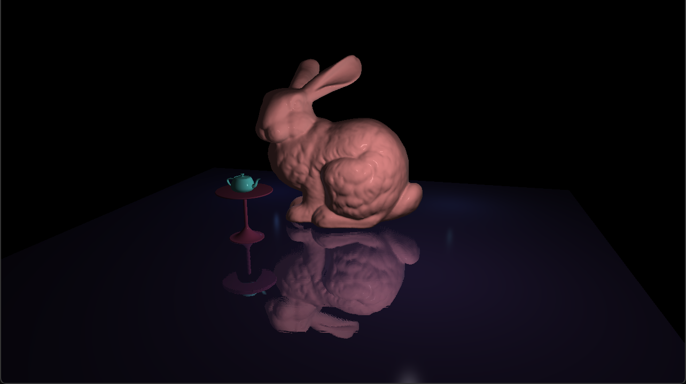

# SSR
Screen Space Reflections - OpenGL
An Implementation of the Screen Space Reflection technique in OpenGL API.
The SSR pass uses the Linear Tracing method and works with the output of the deferred rendering pipeline.

